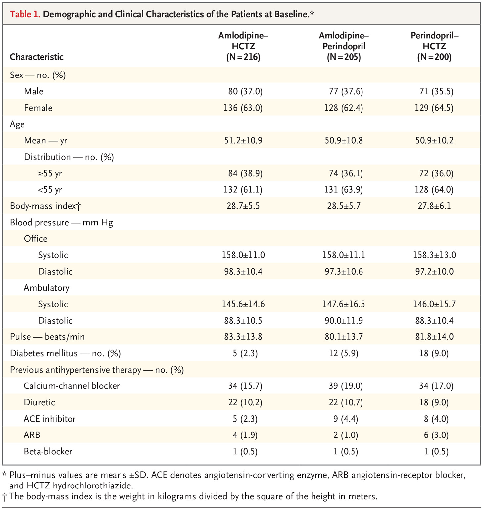

The following comes from the abstract of a paper in the New England Journal of Medicine by Ojji et al. Comparison of Dual Therapies for Lowering Blood Pressure in Black Africans. N Engl J Med 2019;  380:2429-2439

BACKGROUND
The prevalence of hypertension among black African patients is high, and these patients usually need two or more medications for blood-pressure control. However, the most effective two-drug combination that is currently available for blood-pressure control in these patients has not been established.

METHODS
In this randomized, single-blind, three-group trial conducted in six countries in sub-Saharan Africa, we randomly assigned 728 black patients with uncontrolled hypertension ($\ge 140/90$ mm Hg while the patient was not being treated or was taking only one antihypertensive drug) to receive a daily regimen of 5 mg of amlodipine plus 12.5 mg of hydrochlorothiazide, 5 mg of amlodipine plus 4 mg of perindopril, or 4 mg of perindopril plus 12.5 mg of hydrochlorothiazide for 2 months. Doses were then doubled (10 and 25 mg, 10 and 8 mg, and 8 and 25 mg, respectively) for an additional 4 months. The primary end point was the change in the 24-hour ambulatory systolic blood pressure between baseline and 6 months.


```{r, echo=F, fig.align='center', out.width = "400px"}

```
