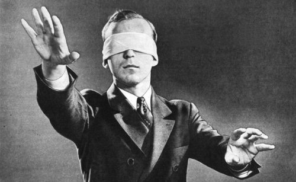

<!-- libraries -->
```{r,include=FALSE,purl=FALSE}
library(knitr) # for include_graphics() 
library(dplyr)
```


<!-- define function for external images -->
```{r,include=FALSE,purl=FALSE}
image<-function(ff,ss,cc=NULL,ll=NULL){
  if(is.null(cc)){
    paste('\\centering','\n',
          '\\includegraphics[scale=',ss,']{',ff,'}',
          sep='')
  } else {
    paste('\\centering','\n',
          '\\copyrightbox[b]{',
          '\\includegraphics[scale=',ss,']{',ff,'}',
          '}{\\raggedleft{\\tiny \\href{',ll,'}{',cc,'}}}',
          sep='')    
  }
}
```

<!-- define function for links -->
```{r,include=FALSE,purl=FALSE}
link<-function(tt,ll){
  paste('[\\textcolor[HTML]{ffa328}{\\ul{',tt,'}}]','(',ll,')',sep='')
}
```

### Learning objectives for today
- Understanding terminology related to studies with an experimental design
- Learn some concepts related to study quality and sources of bias 
- Discuss some principles of ethics related to experimental designs including some historical examples that illustrate ethical violations and how these have influenced development of regulations in experimental studies
  
## Experimental designs

### What are the "experimental units" or the "level of randomization"
When we are assigning an exposure/treatment we can do this for different levels 

These could be:

- Individuals
- Households
- Groups 
- clinics

If we think about our resulting data, each of these might be a row in our data frame.
(note if we have multiple observations over time then we might have a *long* dataset, or *longitudinal data* this means we would have multiple rows for each "unit" of analysis)

What are some examples of exposures we might randomize at these different levels?

### Randomization
Randomization indicates that the treatment(s)/exposure(s) of interest have been assigned randomly, or by chance alone.
Why do we do this?  What advantage does this have?


### Think back to the music and school performance example...

```{r dag, echo=F, fig.height=1.5, fig.width=3, warning=FALSE}
#students, you don't need to know the dagitty package or understand this code
library(dagitty)

g <- dagitty('dag {
    Music.Lessons [pos="0,1"]
    High.grades [pos="2,1"]
    Family.income [pos="1.7,0.5"]
    
    Music.Lessons -> High.grades 
    Family.income -> Music.Lessons
    Family.income -> High.grades
}')
plot(g)
```


### Think back to the music and school performance example...

```{r dag2, echo=F, fig.height=1.5, fig.width=3, warning=FALSE}
#students, you don't need to know the dagitty package or understand this code
library(dagitty)

g2 <- dagitty('dag {
    Randomization [pos="0,0"]
    Music.Lessons [pos="1,1"]
    High.grades [pos="3,1"]
    Family.income [pos="1.7,0.5"]
    
    Music.Lessons -> High.grades 
    Randomization -> Music.Lessons
    Family.income -> High.grades
}')
plot(g2)
```


### Randomization
A very simple example of a randomized trial would be one in which:

- the units of randomization are nearly identical 
- only one treatment/exposure group and one control group
- simple randomization
- effects are immediate or in the short term

### Comparison group
In every calculation of measure of effect, we must choose a comparison group.  Under the best of circumstances this group would be a "counterfactual" meaning that that they would represent the experience that the treated group would have had, if they had an alternate exposure (had not been treated).  

Usually in a trial, we recruit our participants/groups/units and randomize them to either an intervention or a "control" condition.   

**note:  size matters here - why would we want more than one unit in each group?

### Uncontrolled trials

Imagine that we had a vaccine trial where we recruited 50,000 individuals who received a vaccine.  Suppose that 0.1% of our participants experienced an adverse event in the 3 weeks following vaccination.  Does this give us evidence that the vaccine is harmful?  Why or why not?

### RCT?
You may hear a study referred to as an "RCT" -what is this?

R - randomized

C - controlled

T - trial

### Other frequently seen trial terms...


- Cluster randomized

- Community randomized

- Blind, Double blind, Triple blind...

- Placebo controlled


### Blinding

```{r blind, echo=F, out.width = "60%", fig.align='left'}

```
When we talk about blinding we are talking about keeping the treatment assignment hidden.
There are multiple groups we might want to consider keeping this knowledge from.

### Blinding
- In a single blind trial is usually the participants who are blinded
- In a double blind trial we are generally talking about blinding of the participants and the people doing the assessment of outcomes
- Triple blinding is often referring to blinding the participants, study staff, and also the investigators and statistical analysts.

Why do you think blinding is important?

Why might we have a trial where we do not blind?


### Placebo
<div style= "float:right;position: relative; top: -80px;">
```{r nytm, echo=F, out.width = "40%", fig.align='left'}
knitr::include_graphics("placebo.png")
```
</div>

### Placebo
A placebo is a non-active substitute for treatment.
In a drug trial, the placebo is usually a pill made to look identical to the medication being tested, but that does not have the active ingredient.

### What is the placebo effect?

- from *`r link('New York Times Magazine','https://www.nytimes.com/2018/11/07/magazine/placebo-effect-medicine.html')`*, November 2018:

```{r nytm2, echo=F, out.width = "80%"}
knitr::include_graphics("drlarry.png")
``` 
 
### Why not always randomize???
If we believe that randomization is the "gold standard"  then why not only get our information from RCTs?


### Why not always randomize???
If we believe that randomization is the "gold standard"  then why not only get our information from RCTs?

- who participates (who joins, who stays)

- cost, logistics, feasibility

- not a good measure of real world effects

- not possible or ethical to randomize

- time needed to get an answer...

and many others...

## Sources of Bias

### Sampling bias
If our sampling frame does not cover our target population, this is a bias in the sampling process.

Your book refers to this as under-coverage bias.

What might be an example of this?

### Small size
As we saw previously in our example of online reviews, small samples often give unpredictable results.  The smaller an effect is, or the more rare the conditions you are studying, the larger the sample needs to be in order to draw conclusions. 

We will talk much more about sample size later in the course.

Often trials are designed to find a **statistically significant** difference between treatment and control. 
This means an observed effect so large that it would rarely occur by chance.  

As we move into the next sections we will talk more about probability and assessing the role of chance.
In part III of the course we will talk more about statistical significance in assessing differences between groups.

### Participation
Once sampled an individual may not agree to participate.  
This is referred to as **response bias** or **non-response**.
If there is enough information about who did and did not respond, the data may be adjusted to try and compensate for this type of bias.  This kind of adjustment is common in survey samples.

Participants may also start the study and then drop out or become **lost to follow up**.  If one of your study groups is more likely to be lost this can create bias.

### Contamination
When either the study participants randomized to control receive the medication or exposure that was intended to be given only to treatment arm participants. 

Examples:

- [MRFIT trial](http://www.epi.umn.edu/cvdepi/study-synopsis/multiple-risk-factor-intervention-trial-mrfit/)
- [SHAZ!](https://journals.plos.org/plosone/article?id=10.1371/journal.pone.0113621)

### Adherence
Once a participant is randomized to a given treatment, they do not always **adhere** to that treatment.

Often we do two types of analyses with trial data when there are issues of adherence.  

**Intention to treat** and **Per protocol**


### Measurement error
Errors associated with imperfect measurement including:

- imprecise measurement equipment
- poorly designed or worded questions
- responses of the individual to the measurement process
    - white coat hypertension
    - sleep studies in lab environments

Important to distinguish errors that are **systematic**

### Issues with self report
In addition to the biases that may come with the design of questions you ask a participant in surveys,
there can be biases associated with willingness or ability to report information:

- social desirability biases
- poor recall
- biased recall
- diary compliance


## Trial Ethics and historical attrocities

### Ethical issues in trials
While this is primarily a methods course, I feel it is important to highlight some of the ethical issues in study design.

This section of the lecture includes some examples of atrocities committed against marginalized groups. The goal is to provide some of the background context for regulations that now govern experimental trials.  

If you need to step away from the lecture please do so.  

### Assuming it is possible, is it ethical to randomize an exposure?
Is it ethical to randomize individuals to lack of sleep?

Is it ethical to randomize individuals to be exposed to an infectious disease?

Is it ethical to randomize fetuses to different levels of maternal smoking or alcohol consumption?


### Tuskegee syphilis study
Famous example of an unethical trial is the Tuskegee syphilis study which started in 1932 and ended in 1972.
Several hundred black men were observed for the "natural progression" of syphilis in Tuskegee, Alabama.

The men were told that they were being treated, when they were not, and effective treatment was never provided. 

Penicillin became the treatment of choice for syphilis in 1945.  It was very effective, but was not given to the men in the study.  

The original study was planned for 6 months, but instead lasted 40 years and only ended after news articles were published that condemned the study.

### Tuskegee syphilis study
There were many ethical issues with the Tuskegee study including

- Lack of informed consent
- Withholding of effective treatment (lack of equipoise)
- Underlying racism: why was this study performed only on Black men? Would this study have been performed in the same way if the participants had been White men?

- timeline of the study is here *`r link('CDC','https://www.cdc.gov/tuskegee/timeline.htm')`*

### Background:  Residential schools in Canada
- Approximately 1879-1979
- Over 150,000 children attended these schools 
    - 80,000 still alive today
    
- Children forbidden to speak their native languages or acknowledge their cultures
- Systematic abuse 
- According to a Chief medical officer in 1909, early mortality of 30% - 60% within 5 years of entry
- According to the Truth and Reconciliation Commission 6,000 children (1 in 25 students) are estimated to have died while attending 
    

### Nutritional experiments among residential schools for Indigenous children in Canada

- Nutritional experiments performed on the children 
- Control and treatment groups of malnourished children were denied adequate nutrition
- Treatments provided were inadequate, sometimes harmful and likely contributed to deaths
- "...efforts were made to control as many factors as possible, even when they harmed the research subjects...dental care was denied...researchers wanted to observe the state of dental caries and gingivitis with malnutrition"


### Nutritional experiments among residential schools for Indigenous children in Canada

- No informed consent:  Who can give consent?  Here the parents were not informed
- Effective treatment withheld
- Underlying cultural genocide:  The Truth and Reconciliation Committee deemed the complsory schooling of Indigenous children a cultural genocide.

MacDonald NE, Stanwick R, Lynk A.  Canada's shameful history of nutrition research on residential school children:  the need for strong medical ethics in Aboriginal health research.


## Ethical principles and current regulations


### Key influential documents
The *[Nuremberg Code](https://www.nejm.org/doi/full/10.1056/nejm199711133372006#:~:text=The%20Code%20was%20formulated%2050,%2Dcalled%20Doctors'%20Trial)* - following the trials of Nazi doctors after World War II

The Nuremberg Code is the basis for Title 45 and 46 in the code of US federal regulations.
These regulations are used by institutional review boards. All studies of human subjects conducted in the United States must be approved by these review boards.

### Nuremberg Principles
1. The voluntary consent of the human subject is absolutely essential.
2. The experiment should be such as to yield fruitful results for the
good of society, unprocurable by other methods or means of study,
and not random and unnecessary in nature.
3. The experiment should be so designed and based on the results of
animal experimentation and a knowledge of the natural history of
the disease or other problem under study that the anticipated
results will justify the performance of the experiment.


### Nuremberg Principles
4. The experiment should be so conducted as to avoid all unnecessary
physical and mental suffering and injury.
5. No experiment should be conducted where there is an a priori reason to
believe that death or disabling injury will occur; except, perhaps, in those
experiments where the experimental physicians also serve as subjects.
6. The degree of risk to be taken should never exceed that determined by
the humanitarian importance of the problem to be solved by the
experiment.
7. Proper preparations should be made and adequate facilities provided to
protect the experimental subject against even remote possibilities of
injury, disability, or death.


### Nuremberg Principles
8. The experiment should be conducted only by scientifically qualified persons.
The highest degree of skill and care should be required through all stages of the
experiment of those who conduct or engage in the experiment.
9. During the course of the experiment the human subject should be at liberty to
bring the experiment to an end if he has reached the physical or mental state
where continuation of the experiment seems to him to be impossible.
10. During the course of the experiment the scientist in charge must be prepared to
terminate the experiment at any stage, if he has probable cause to believe, in
the exercise of the good faith, superior skill and careful judgment required of
him that a continuation of the experiment is likely to result in injury, disability,
or death to the experimental subject.

### Key influential documents
The *[Belmont Report](https://www.hhs.gov/ohrp/regulations-and-policy/belmont-report/index.html)* - published in 1978 following scandals in the 1970s.
The Belmont Report established three core principles of research:

- respect for persons
- beneficence
- justice 


### Informed consent

1st principle of the Nurenberg code: voluntary consent of the individual is absolutely essential.

- what information is required for "informed" consent?
- who can provide informed consent?


### Coercion
If the incentives to join a study are too strong, participants may be willing to consent (even with informed consent) to conditions they would not otherwise accept.

- Large payments
- Access to treatment not otherwise available
- Fear of loosing medical care


### Equipoise
- Requires general uncertainty in the medical (clinical) community if the
newly proposed treatment will be beneficial
- The assumption that there is not one 'better' intervention present
(for either the control or experimental group) during the design of a
randomized controlled trial (RCT).
- What would happen if researchers enrolled participants in a study
that compared the effect of Treatment A vs. Treatment B on mortality
when there is moderate medical evidence that Treatment B is less
effective or has many serious side effects?


[Reference](https://ethics.gc.ca/eng/tcps2-eptc2_2018_chapter11-chapitre11.html#a)


### Who benefits from the study, who is included
There is also a larger issue of justice and ethics related to who benefits from the trial.

- Is there a direct benefit to participants?
- Is there a potential benefit to individuals who are similar to the study participants?
- Is there a group that is excluded from participation unfairly?

### Data sovereignty
Who owns the data?

The First Nations Indigenous Governance Centre. First Nations data sovereignty in Canada. Statistical Journal of the IAOS. 2019; 35:47-49.

Taylor J, Kukutai T, eds. Indigenous Data Sovereignty: Toward an Agenda. Centre for Aboriginal Economic Policy Research (CAEPR). Research
Monograph No. 38. (Features a chapter, “Pathways to First Nations’ data and information sovereignty”, authored by FNIGC). Australian
National University Press. 2016.

### Data sovereignty
- Methods and approaches used to gather, analyze and share data on Indigenous
communities has reinforced systemic oppression, barriers and unequal power
relations.
- Data on Indigenous communities has typically been collected and interpreted
through a lens of inherent lack, with a focus on statistics that reflect
disadvantage and negative stereotyping.
-  Data on Indigenous communities collected by nation state institutions has been
of little use to Indigenous communities, further distancing Nations from the
information.
-  Data on Indigenous communities collected by the nation state government has
been assumed to be owned and therefore controlled by said government.
-  With a lack of a meaningful Nation-to-Nation dialogue about data sovereignty.

British Columbia First Nations’ Data Governance Initiative (BCFNDGI). Decolonizing Data: Indigenous Data Sovereignty Primer.
Prepared by Open North. April 2017


### Parting humor

```{r sun, echo=F, out.width = "60%", fig.align='center'}
knitr::include_graphics("assimilate.png")
```

