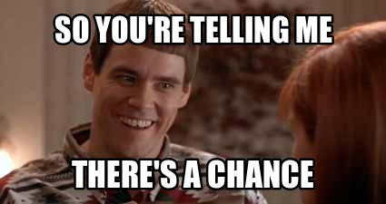
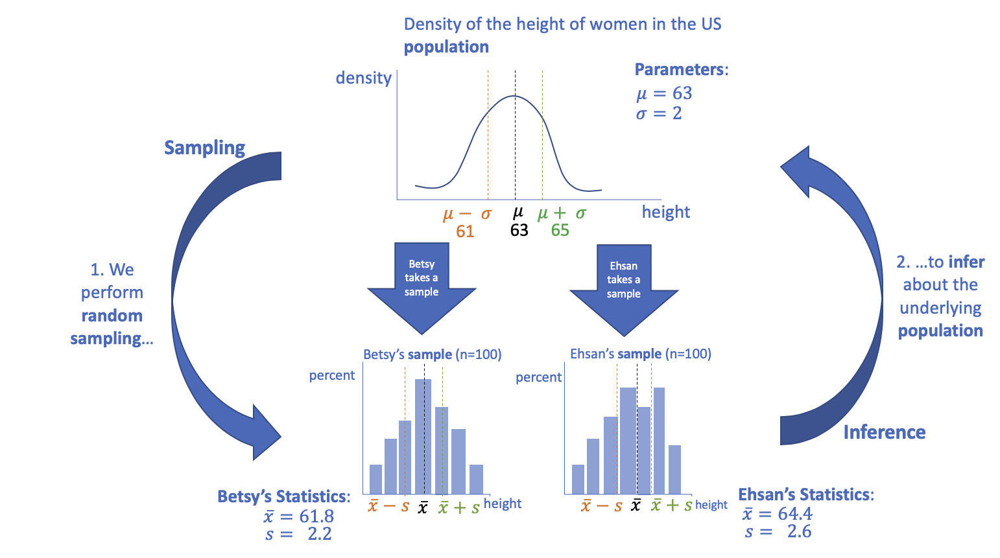
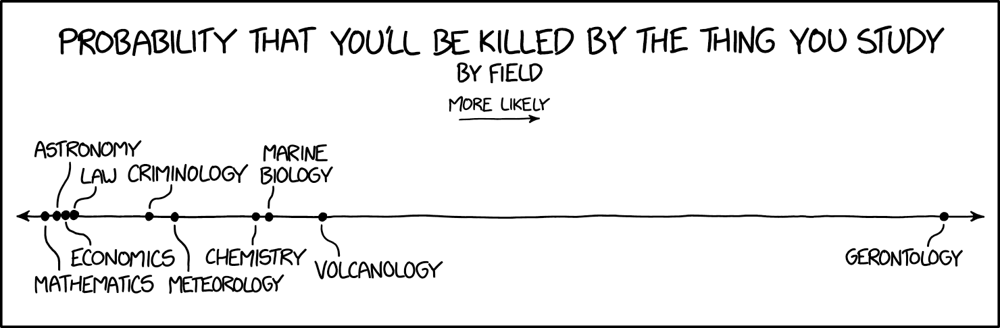

<!-- libraries -->
```{r,include=FALSE,purl=FALSE}
library(knitr) # for include_graphics() 
library(dplyr)
```

<!-- define default size for R graphics -->
```{r,include=FALSE,purl=FALSE}
outputFormat<-opts_knit$get('rmarkdown.pandoc.to')
if(outputFormat=="beamer"){
  opts_chunk$set(fig.width=6,fig.height=4)
}
```

<!-- define function for external images -->
```{r,include=FALSE,purl=FALSE}
image<-function(ff,ss,cc=NULL,ll=NULL){
  if(is.null(cc)){
    paste('\\centering','\n',
          '\\includegraphics[scale=',ss,']{',ff,'}',
          sep='')
  } else {
    paste('\\centering','\n',
          '\\copyrightbox[b]{',
          '\\includegraphics[scale=',ss,']{',ff,'}',
          '}{\\raggedleft{\\tiny \\href{',ll,'}{',cc,'}}}',
          sep='')    
  }
}
```

<!-- define function for links -->
```{r,include=FALSE,purl=FALSE}
link<-function(tt,ll){
  paste('[\\textcolor[HTML]{ffa328}{\\ul{',tt,'}}]','(',ll,')',sep='')
}
```


```{r load-libraries, message=F, warning=FALSE, echo=F}
library(ggplot2)
library(dplyr)
library(patchwork)
library(readxl)
library(ggrepel)
library(gridExtra)
library(cowplot)
```

### Statistics is everywhere: the "chance of rain"
```{r, out.width="80%", echo=F}
knitr::include_graphics("weather.png")
```

### Different definitions
According to the U.S. National Weather Service (NWS), PoP is the probability of excedance that more than 0.01 inches (0.25 mm) of precipitation will fall in a single spot, averaged over the forecast area. This can be expressed mathematically as
$$PoP=C\times A$$
where C is the confidence that any form of precipitation (e.g., snow or rain) will occur somewhere in the forecast area and A is the percent of the area that will receive measurable precipitation, if it occurs at all. For instance, if there is a 100% probability of rain covering one half of a city, and a 0% probability of rain on the other half of the city, the POP for the city would be 50%. A 50% chance of a rainstorm covering the entire city would also lead to a PoP of 50%.

The PoP measure is meaningless unless it is associated with a period of time. NWS forecasts commonly use PoP defined over 12-hour periods (PoP12), A "daytime" PoP12 means from 6 am to 6 pm.

### Different definitions

Environment Canada reports a chance of precipitation (COP) that is defined as "The chance that measurable precipitation (0.2 mm of rain or 0.2 cm of snow) will fall on any random point of the forecast region during the forecast period." The values are rounded to 10% increments.

### Different definitions

If there is a 20% chance that at least .3mm of rain will fall on 50% of a city, which forecast (US or Canadian) will give a higher percent probability of rain?

How might this change your behavior (bringing an umbrella or not)?

### Learning objectives for today
- Why does probability matter?
- Terminology for probability: sample space (discrete vs. continuous), event, discrete probability model, continuous probability model
- The frequentist definition of probability and how sample size affects our estimation
- Some basic rules for probability
- Definition of a random variable

### Why is probability important:

Although we don't always explicitly discuss probability, we think about probability all the time:
  
  - Probability of rain today
  - Probability of getting a job of a certain income range with a certain college degree
  - Probability of a question showing up on the next exam

Statistics can be misleading, knowing the basic rules of probability and understanding how they are generated can help you to interpret statistics clearly, think critically about information and draw relevant conclusions.

### Statistics is everywhere:  COVID risk

An interesting project to check out is the [COVID-19 Event Risk Assessment Planning Tool](https://covid19risk.biosci.gatech.edu/) 

```{r, out.width="60%", echo=F}
knitr::include_graphics("COVID-risk-tool.png")
```

### Why is probability important:
 - Statistics can be used to make and defend policy decisions - sometimes these are misleading (can be intentionally) 
  You should know how to interpret those statistics for yourself
 - Determining probability can be difficult and not intuitive.  Our gut instinct about the probability of an event may be way off and lead to poor decision making in policy, medical or personal settings.
 - Using predictive models to calculate probabilities sounds like an objective process, however these models can encode bias and discrimination.  
 
### Example. 1: Misleading statistics

- Kirstjen Nielsen, former Homeland Security Secretary stated, about folks at the 
US-Mexico border:

> “Again, let’s just pause to think about this statistic: **314 percent** 
increase in adults showing up with kids that are not a family unit...Those are 
traffickers, those are smugglers, that is MS-13, those are criminals, those are 
abusers.”

- Nielsen was speaking about a relative increase in the probability of the event 
of "adults with kids who are not their own at the US-Mexico border". The 
relative increase is very large (314%). However, how often did the event happen 
in the first place?

- In a Washington Post analysis^1^, the increase was from 0.19% in
2017 to 0.61% in 2018. Thus the actual chance of the event happening is very 
small and increased by 0.61%-0.19% = 0.42 percentage points. 

### Example. 1: Misleading statistics
- Takeaway: looking at the increase in absolute percentage points provides a 
different interpretation than the increase on the relative scale.

Reference: https://www.washingtonpost.com/news/politics/wp/2018/06/18/how-to-mislead-with-statistics-dhs-secretary-nielsen-edition/?noredirect=on&utm_term=.9193534ee80c

### Example 2: Calculating probabilities in medical settings can be difficult and not intuitive

- Suppose that there is test for a specific type of cancer that has a 90% chance 
of a positive screening test result for cancer if the individual truly has cancer and a 90% chance of 
testing negative for cancer when the individual does not have it. 
- 1% of patients in the population have the cancer being tested for. 
- What is the chance that a patient has cancer given that they test positive? 

a) Between 0% - 24.9%
b) Between 25.0% - 49.9%
c) Between 50.0% - 74.9%
d) Between 75.0% - 100%

### Example 2: Calculating probabilities in medical settings can be difficult and not intuitive

Many people choose 4), but the true answer is 1)! Why do we get this so wrong?

Video link (2 mins): [click here](https://www.youtube.com/watch?v=nuSqWRuz-mU&feature=youtu.be) 

**we will delve more into screening probabilities as we move forward**

## What is probability?

### Fundamental components 
Probability can be thought of in three fundamental components:

- A random experiment
- All possible outcomes of that experiment
- An **event** or events of interest

### Sample space
We refer to the entire set of possible outcomes as the **Sample Space**

All possible outcomes of a sample space ($S$) together have a probability of 1. 
     $P(S) = 1$
     
### Sample space
- **Discrete sample space**
    - e.g., Marital status: S = {Single, married, divorced, widowed}
    - careful, discrete spaces remind us of nominal, ordinal, or discrete variables
    - anything that is countable with "gaps" between the events
    - the notation is important: S = {elements in the space}
- **Continuous sample space**
    - e.g., The interval [0, 1]: S = {all numbers between 0 and 1}
    - continuous sample spaces remind us of continuous variables only
    - the events are not countable (i.e., we cannot list the numbers between 0 and 1, there are infinite)


### Defining probability
The probability or occurrence of an event A often called the probability of A and denoted as P(A) is the ratio of the number of outcomes where event A occurs to the total number of possible outcomes.

For a coin what is the probability of heads?


- **Probability model**: Description of random phenomena. Consists of sample 
space $S$ and a way of assigning probabilities to events


## Frequentist probability

### Frequentist definition
- Probability corresponds to frequency over many repetitions
- For example, the probability of a coin landing heads on a single toss is 0.5: if we toss a coin numerous times, we would expect one-half of the tosses to land heads, the more times we toss the coin the closer we expect the fraction of tosses to come to exactly half.  

### From B&M: How common is the common cold?

- Suppose that there are 100,000 people in your community. You work for your 
community's public health office and want to estimate the number of people who 
had a common cold. You are not able to sample everyone but suppose you could 
randomly call people in your community and ask them "Did you have a cold 
yesterday?" and then calculate the proportion of the sample who had a cold. 

### From B&M: How common is the common cold?

- Here are the dimensions, a data frame for the **whole population**, and the mean 
of the variable `had_cold_yesterday`:

```{r create-cold-data, echo=F}
#students: you don't need to understand this code chunk yet. 

population_size <- 100000
prob_cold <- 0.112
id <- 1:population_size
set.seed(1234)
# Generate n random binomial samples (coin flips) where 
# probability of cold (heads) is prob_cold
had_cold_yesterday <- rbinom(n = population_size, size = 1, prob = prob_cold) 
#each person has an 11.2% chance of having the common cold yesterday
cold_data <- data.frame(id, had_cold_yesterday)
```

```{r}
dim(cold_data)
cold_data %>% summarize(population_mean = mean(had_cold_yesterday))
```

- Note that the mean of a 0/1 variable is called a **proportion**. This is because 
the mean is the number of individuals with a cold (coded as `had_cold_yesterday = 1`)
divided by the total number of individuals.

### From B&M page 216: How common is the common cold?

How big should your sample size be?

- We want to sample enough people such that the proportion of those with colds
in the sample is close to the proportion of those with colds in the population

- Let's take samples of size 5, 100, and so on using `dplyr`'s `sample_n`
function:

```{r the-smallest-samples}
sample_5 <- dplyr::sample_n(tbl = cold_data, size = 5)
sample_100 <- dplyr::sample_n(tbl = cold_data, size = 100)
sample_1000 <- dplyr::sample_n(tbl = cold_data, size = 1000)
sample_10000 <- dplyr::sample_n(tbl = cold_data, size = 10000)
sample_100000 <- dplyr::sample_n(tbl = cold_data, size = 100000)
```

### Now estimate the proportion of those with a cold in the random samples

```{r results-from-the-smallest-samples, echo=FALSE}
sample_5 %>% summarize(sample_mean_n5 = mean(had_cold_yesterday))
sample_100 %>% summarize(sample_mean_n100 = mean(had_cold_yesterday))
sample_1000 %>% summarize(sample_mean_n1k = mean(had_cold_yesterday))
sample_10000 %>% summarize(sample_mean_n10k = mean(had_cold_yesterday))
sample_100000 %>% summarize(sample_mean_n100k = mean(had_cold_yesterday))
```

### Estimate the proportion of those with a cold in the random samples
- What do you notice about the proportion estimates? 
- Do they approach the true estimate as the sample size increases?

### How many people should we sample?

- So we know we should sample more than five people, but feasibly can't sample 
everyone. 

- We need to sample *enough* people to reasonably estimate the true chance of 
having a cold. But how many is enough?

### Look at the sample's estimated proportion as a function of sample size

* To help us decide I first sampled one person and took the mean of that sample.

* Then I added another person and took the mean of that sample of size 2 (n=2).
... and so on, until I had 5000 people. 

* The plot on the next slide shows the estimated proportion vs. the sample size.

```{r three-growing-samples-of-5000, echo=F, eval=F}
# students, you don't need to understand this code chunk

# inspirational TODO for CR/MKD (for future reference, not for right now): make this into a 
# shiny app that updates a growing plot after continuing to add one more person 
# into the sample to show how the estimate updated each time.

cold_data_copy <- cold_data
cold_data_copy$in_sample1 <- 0
cold_data_copy$in_sample2 <- 0
cold_data_copy$in_sample3 <- 0
grow_data1 <- grow_data2 <- grow_data3 <- NULL

for(i in 1:5000){
  sample_1 <- cold_data_copy %>% 
    filter(in_sample1 == 0) %>% 
    sample_n(1)
  cold_data_copy$in_sample1[cold_data_copy$id == sample_1$id] <- 1
  new <- cold_data_copy %>% filter(in_sample1 == 1) %>% 
    summarize(mean = mean(had_cold_yesterday),
              sample_size = n())
  grow_data1 <- rbind(grow_data1, new)
  
  sample_2 <- cold_data_copy %>% 
    filter(in_sample2 == 0) %>% 
    sample_n(1)
  cold_data_copy$in_sample2[cold_data_copy$id == sample_2$id] <- 1
  new <- cold_data_copy %>% 
    filter(in_sample2 == 1) %>% 
    summarize(mean = mean(had_cold_yesterday),
              sample_size = n())
  grow_data2 <- rbind(grow_data2, new)
  
  sample_3 <- cold_data_copy %>% 
    filter(in_sample3 == 0) %>% 
    sample_n(1)
  cold_data_copy$in_sample3[cold_data_copy$id == sample_3$id] <- 1
  new <- cold_data_copy %>% 
    filter(in_sample3 == 1) %>% 
    summarize(mean = mean(had_cold_yesterday),
              sample_size = n())
  grow_data3 <- rbind(grow_data3, new)
}

grow_data1 <- grow_data1 %>% mutate(sample = "First sample")
grow_data2 <- grow_data2 %>% mutate(sample = "Second sample")
grow_data3 <- grow_data3 %>% mutate(sample = "Third sample")

grow_data <- rbind(grow_data1, grow_data2, grow_data3)
## Saving image because this part takes a long time
save.image("../Data/chp9.rdata")
```

### Estimated proportion vs. sample size for n = 250

```{r first-sample-250, echo=F,fig.align='center', message=F, warning=F, out.width = "80%"}
# students, don't worry about this code

load("chp9.rdata")
segment1 <- data.frame(x1 = 1, x2 = 1000, y1 = prob_cold, y2 = prob_cold)
segment2 <- data.frame(x1 = 1, x2 = 1000, y1 = prob_cold + 0.05, y2 = prob_cold + 0.05)
segment3 <- data.frame(x1 = 1, x2 = 1000, y1 = prob_cold - 0.05, y2 = prob_cold - 0.05)
segment4 <- data.frame(x1 = 1, x2 = 1000, y1 = prob_cold + 0.02, y2 = prob_cold + 0.02)
segment5 <- data.frame(x1 = 1, x2 = 1000, y1 = prob_cold - 0.02, y2 = prob_cold - 0.02)

p1 <- ggplot(grow_data %>% dplyr::filter(sample_size < 250, sample == "First sample"), 
             aes(x = sample_size, y = mean)) + 
  geom_segment(aes(y = y1, yend = y2, x = x1, xend = x2), data = segment1) + 
  geom_segment(aes(y = y1, yend = y2, x = x1, xend = x2), data = segment2, lty = 3) + 
  geom_segment(aes(y = y1, yend = y2, x = x1, xend = x2), data = segment3, lty = 3) + 
  geom_segment(aes(y = y1, yend = y2, x = x1, xend = x2), data = segment4, lty = 3) + 
  geom_segment(aes(y = y1, yend = y2, x = x1, xend = x2), data = segment5, lty = 3) + 
  geom_text(aes(y = prob_cold + 0.005, x = 800), label = "pop'n proportion", check_overlap = T) +
  geom_text(aes(y = prob_cold + 0.05, x = 900), label = "+ 5", check_overlap = T) + 
  geom_text(aes(y = prob_cold - 0.05, x = 900), label = "- 5", check_overlap = T) + 
  geom_text(aes(y = prob_cold + 0.02, x = 900), label = "+ 2", check_overlap = T) + 
  geom_text(aes(y = prob_cold - 0.02, x = 900), label = "- 2", check_overlap = T) + 
  geom_line(aes(col = factor(sample))) + 
  labs(y = "Estimated proportion", x = "Sample size", 
       title = "n=250, one sample") +
  theme_minimal(base_size = 15) + 
  scale_x_continuous(breaks = seq(0, 1000, 200)) +
  scale_y_continuous(labels = scales::percent, breaks = seq(0, 0.18, 0.02), 
                     limits = c(0, 0.18)) + 
  theme(panel.grid.minor = element_blank(), legend.position = "top", legend.title = element_blank())

# Now we add the line for the second sample of 250:
p2 <- ggplot(grow_data %>% dplyr::filter(sample_size < 250, sample != "Third sample"), 
             aes(x = sample_size, y = mean)) + 
  geom_segment(aes(y = y1, yend = y2, x = x1, xend = x2), data = segment1) + 
  geom_segment(aes(y = y1, yend = y2, x = x1, xend = x2), data = segment2, lty = 3) + 
  geom_segment(aes(y = y1, yend = y2, x = x1, xend = x2), data = segment3, lty = 3) + 
  geom_segment(aes(y = y1, yend = y2, x = x1, xend = x2), data = segment4, lty = 3) + 
  geom_segment(aes(y = y1, yend = y2, x = x1, xend = x2), data = segment5, lty = 3) + 
  geom_text(aes(y = prob_cold+0.005, x = 800), label = "pop'n proportion", check_overlap = T) +
  geom_text(aes(y = prob_cold + 0.05, x = 900), label = "+ 5", check_overlap = T) + 
  geom_text(aes(y = prob_cold - 0.05, x = 900), label = "- 5", check_overlap = T) + 
  geom_text(aes(y = prob_cold + 0.02, x = 900), label = "+ 2", check_overlap = T) + 
  geom_text(aes(y = prob_cold - 0.02, x = 900), label = "- 2", check_overlap = T) + 
  geom_line(aes(col = factor(sample))) + 
  labs(y = "Estimated proportion", x = "Sample size",
       title = "n=250, two samples") +
  theme_minimal(base_size = 15) +
  scale_x_continuous(breaks = seq(0, 1000, 200)) +
  scale_y_continuous(labels = scales::percent, breaks = seq(0, 0.18, 0.02), 
                     limits = c(0, 0.18)) +
  theme(panel.grid.minor = element_blank(), legend.position = "top", legend.title = element_blank()) 
  
p1 + p2 + plot_layout()  
```

### Estimated proportion vs. sample size for n = 500 

- Increase the sample size how the estimate becomes closer to the true value
- Add in a third sample to compare how different samples perform in the short 
vs. the long run 

```{r sample-250-500, echo=F, fig.align='center', message=F, warning=F, out.width="80%"}
p3 <- ggplot(grow_data %>% dplyr::filter(sample_size < 250), aes(x = sample_size, y = mean)) + 
  geom_segment(aes(y = y1, yend = y2, x = x1, xend = x2), data = segment1) + 
  geom_segment(aes(y = y1, yend = y2, x = x1, xend = x2), data = segment2, lty = 3) + 
  geom_segment(aes(y = y1, yend = y2, x = x1, xend = x2), data = segment3, lty = 3) + 
  geom_segment(aes(y = y1, yend = y2, x = x1, xend = x2), data = segment4, lty = 3) + 
  geom_segment(aes(y = y1, yend = y2, x = x1, xend = x2), data = segment5, lty = 3) + 
    geom_text(aes(y = prob_cold+0.005, x = 800), label = "pop'n proportion", check_overlap = T) +
  geom_text(aes(y = prob_cold + 0.05, x = 900), label = "+ 5", check_overlap = T) + 
  geom_text(aes(y = prob_cold - 0.05, x = 900), label = "- 5", check_overlap = T) + 
  geom_text(aes(y = prob_cold + 0.02, x = 900), label = "+ 2", check_overlap = T) + 
  geom_text(aes(y = prob_cold - 0.02, x = 900), label = "- 2", check_overlap = T) + 
  geom_line(aes(col = factor(sample))) + 
  labs(y = "Estimated proportion", x = "Sample size", 
       title = "n = 250, 3 samples") + 
  scale_x_continuous(breaks = seq(0, 1000, 200)) +
  scale_y_continuous(labels = scales::percent, breaks = seq(0, 0.80, 0.02)) +
  theme_minimal(base_size = 15) +
  theme(legend.position="none", panel.grid.minor = element_blank())

p4 <- ggplot(grow_data %>% dplyr::filter(sample_size < 500), aes(x = sample_size, y = mean)) + 
  geom_segment(aes(y = y1, yend = y2, x = x1, xend = x2), data = segment1) + 
  geom_segment(aes(y = y1, yend = y2, x = x1, xend = x2), data = segment2, lty = 3) + 
  geom_segment(aes(y = y1, yend = y2, x = x1, xend = x2), data = segment3, lty = 3) + 
  geom_segment(aes(y = y1, yend = y2, x = x1, xend = x2), data = segment4, lty = 3) + 
  geom_segment(aes(y = y1, yend = y2, x = x1, xend = x2), data = segment5, lty = 3) + 
    geom_text(aes(y = prob_cold+0.005, x = 800), label = "pop'n proportion", check_overlap = T) +
  geom_text(aes(y = prob_cold + 0.05, x = 900), label = "+ 5", check_overlap = T) + 
  geom_text(aes(y = prob_cold - 0.05, x = 900), label = "- 5", check_overlap = T) + 
  geom_text(aes(y = prob_cold + 0.02, x = 900), label = "+ 2", check_overlap = T) + 
  geom_text(aes(y = prob_cold - 0.02, x = 900), label = "- 2", check_overlap = T) + 
  geom_line(aes(col = factor(sample))) + 
  labs(x = "Sample size", y = "Estimated proportion", 
       title = "n = 500, 3 samples") + 
  scale_x_continuous(breaks = seq(0, 1000, 200)) +
  scale_y_continuous(labels = scales::percent, breaks = seq(0, 0.80, 0.02)) +
  theme_minimal(base_size = 15) +
  theme(legend.position="none", panel.grid.minor = element_blank())

segment6 <- data.frame(x1 = 1, x2 = 5000, y1 = prob_cold, y2 = prob_cold)
segment7 <- data.frame(x1 = 1, x2 = 5000, y1 = prob_cold + 0.05, y2 = prob_cold + 0.05)
segment8 <- data.frame(x1 = 1, x2 = 5000, y1 = prob_cold - 0.05, y2 = prob_cold - 0.05)
segment9 <- data.frame(x1 = 1, x2 = 5000, y1 = prob_cold + 0.02, y2 = prob_cold + 0.02)
segment10 <- data.frame(x1 = 1, x2 = 5000, y1 = prob_cold - 0.02, y2 = prob_cold - 0.02)

p3 + p4 + plot_layout()
```

### Estimated proportion vs. sample size for n = 5000

```{r sample-5000, echo=F, fig.align='center', message=F, warning=F, out.width="80%"}
p5 <- ggplot(grow_data %>% dplyr::filter(sample_size < 5000), aes(x = sample_size, y = mean)) + 
  geom_segment(aes(y = y1, yend = y2, x = x1, xend = x2), data = segment6) + 
  geom_segment(aes(y = y1, yend = y2, x = x1, xend = x2), data = segment7, lty = 3) + 
  geom_segment(aes(y = y1, yend = y2, x = x1, xend = x2), data = segment8, lty = 3) + 
  geom_segment(aes(y = y1, yend = y2, x = x1, xend = x2), data = segment9, lty = 3) + 
  geom_segment(aes(y = y1, yend = y2, x = x1, xend = x2), data = segment10, lty = 3) + 
  geom_text(aes(y = prob_cold+0.005, x = 5050), label = "pop'n proportion", check_overlap = T) +
  geom_text(aes(y = prob_cold + 0.05, x = 4200), label = "+5", check_overlap = T) + 
  geom_text(aes(y = prob_cold - 0.05, x = 4200), label = "-5", check_overlap = T) + 
  geom_text(aes(y = prob_cold + 0.02, x = 4200), label = "+2", check_overlap = T) + 
  geom_text(aes(y = prob_cold - 0.02, x = 4200), label = "-2", check_overlap = T) + 
  geom_line(aes(col = factor(sample))) + 
  labs(y = "Estimated proportion", x = "Sample size", 
       title = "n = 5000, 3 samples") + 
  theme_minimal(base_size = 15) +
  scale_x_continuous(breaks = seq(0, 5000, 500)) +
  scale_y_continuous(labels = scales::percent, breaks = seq(0, 0.80, 0.02))  +  
  theme(panel.grid.minor = element_blank(), legend.position = "top", legend.title = element_blank())

p5
```

### Summary of the example on estimating the proportion with a cold

- As the sample size increases, the estimated proportion becomes closer to the 
true proportion
- Random samples of the same size will provide different estimates of the true 
proportion, but will be closer to each other (and the true value) if they are 
"large enough"


## Some vocabulary, definitions, and rules

### Rule of Range
Probabilities are numbers between 0 and 1. 
    
  $0 \leq P(A) \leq 1$

```{r chance, echo=F, out.width = "60%"}

```

What is the probability of a certain event?  Of an impossible event?


### Complement
The total number of outcomes in a random experiment (the sample space) can always divide into two mutually exclusive groups:

outcomes where A occurs P(A)

outcomes where A does not occur $P(\bar{A})$  
  
These are called **complementary events** 
These must cover the entire set of possibilities which sums to 1

Thus $P(A) + P(\bar{A})=1$

### Complement
The probability of the complement is 1 minus the probability of the event occurring. 

-  P(A does not occur) = 1 - P(A)
-  Shorthand: $P(\bar{A}) = 1 - P(A)$ or $P(A^c) = 1 - P(A)$ or $P(A') = 1 - P(A)$


### Composite Events
We stared by defining probability in terms of one event, but we can expand this to think about the probability of more than one event.  For example, let A and B be two separate events.  A **composite event** would then be the event which describes the outcomes of both A and B. 

The composite event where both A and B occur is also referred to as the **intersect** of A and B.

This is sometimes written as P(AB)  or $P(A\cap B)$

The composite event where either A or B occurs is also referred to as the **union** of A and B.

This is sometimes written as P(A or B) or $P(A\cup B)$

### Composite Events
Imagine we have 100 students in a classroom.  
```{r venscomposit, echo=FALSE, message=FALSE, warning=FALSE}
#Students do not need to know how to do this
# install.packages('VennDiagram')
library(VennDiagram)
## cat.pos - position of category titles, represented by degree from the
## middle of the circle

## cat.dist - distance of the category titles from the edge of the circle

grid.newpage()
draw.pairwise.venn(30, 40, 15, category = c("Undegraduate", "Wears glasses"), lty = rep("blank", 
    2), fill = c("light blue", "pink"), alpha = rep(0.5, 2), cat.pos = c(0, 
    0), cat.dist = rep(0.025, 2))
```


### Composite Events
There are 40 students who wear glasses, and 30 who are undergraduates.

Based on the Venn diagram, what is P(Glasses)?  

What is the complement $P(\overline{Glasses})$

What is the union of these two events $P(Glasses\cup Undergraduate)$

What is the intersect of these two events $P(Glasses \cap Undergraduate)$

### Composite Events

If we toss a coin twice, what are the possible composite events in our sample space?

What is the probability of tossing a combination of one Heads and one Tails?

What is the complement of that?


### Probability of pet ownership

What is the probability space here?

```{r, out.width="80%", echo=F}
knitr::include_graphics("catsanddogs.png")
```

[from the economisit article here](https://www.economist.com/graphic-detail/2020/02/11/which-country-spends-the-most-on-its-pets)


### Disjoint events
If two events have a joint probability of 0 (i.e., no overlap in their event spaces $P(A\cap B)=0$) then they are **disjoint** and the probability of either event occurring is the summation of their individual probabilities. 

 $P(A or B) = P(A) + P(B)$, if A and B are disjoint events.
    
Disjoint events are also described as **mutually exclusive** meaning that it is not possible to have both events

## Discrete probability models

### Discrete probability model

- A probability model with a sample space made up of a list of individual outcomes
is called discrete
- To assign probabilities in a discrete model, list the probabilities of all the
individual outcomes. These probabilities must be numbers between 0 and 1 and must
sum to 1. The probability of any event is the sum of the probabilities of the
outcomes making up the event.

### Discrete probability model example

For example, we could survey a sample of people and ask them their marital status. 
Based on this survey we can calculate the portion of each event in the sample space:

| Single | Married | Divorced | Widowed |
|:------:|:-------:|:--------:|:-------:|
| 47%    | 30%     | 18%      | 5%      |

This is a discrete probability model shown in a table. How else could you display these data?

### Continuous probability model

- A continuous probability model assigns probabilities as areas under a **density**
curve. The area under the curve and between a range of specified values on the horizontal 
axis is the probability of an outcome in that range.
- What is a density curve? 

### Density curves

- Density curves are also known as **probabilty density functions**
- You can think of density curves as **smoothed histograms**. 


### Density curves using `geom_density()`

- Recall the data on cesarean delivery rates across hospitals in the US. We can 
use these data to also make a density plot (also called density curve):

```{r cs-variation-plot-example, echo = F, warning=F, message=F, out.width="80%"}
CS_dat <- read_xlsx("Ch02_Kozhimannil_Ex_Cesarean.xlsx", sheet = 1)

CS_dat <- CS_dat %>% 
  dplyr::select(Births, `Cesarean rate *100`) %>%
  dplyr::rename(num_births = Births, cs_rate = `Cesarean rate *100`)

CS_dat <- CS_dat %>% dplyr::mutate(cs_rate_binned = cut(cs_rate, 32))

## Basic histogram from cesarean delivery. Each bin is 2 wide.
basic.hist <- ggplot(CS_dat, aes(x=cs_rate)) + 
  geom_histogram(binwidth = 2) +
  ggtitle("Basic histogram") + 
  theme_minimal(base_size = 15)

# Draw with black outline, white fill
better.hist <- ggplot(CS_dat, aes(x=cs_rate)) + 
  geom_histogram(binwidth = 2, colour="black", fill="white") + 
  ggtitle("Better histogram") + 
  theme_minimal(base_size = 15)

# Density curve (students: be able to make density plots like this)
basic.density <- ggplot(CS_dat, aes(x=cs_rate)) + 
  geom_density() + 
  labs(title = "Basic density") + 
  theme_minimal(base_size = 15)

# Histogram overlaid with density curve
# overlaying density plots onto histograms is a bit tricky,
# so don't worry about learning this bit of code.
density.hist <- ggplot(CS_dat, aes(x=cs_rate)) + 
  geom_histogram(aes(y=..density..),      # Histogram with density instead of count on y-axis
                   binwidth=2,
                   colour="black", fill="white") +
  geom_density(alpha=.2, fill="#FF6666") +  # Overlay with transparent density plot
  ggtitle("Histogram and density") + 
  theme_minimal(base_size = 15)

basic.hist + better.hist + basic.density + density.hist + plot_layout()

# plotting formatting ideas from : http://www.cookbook-r.com/Graphs/Plotting_distributions_(ggplot2)/

# this summary dataset shows the relationship between the proportion in each bin and the density
# since density is an area, you need to take the proportion (height) and divide by the bin width
# (here it is 2.02 based on how we chose our bins) to get the density.
CS.summary <- CS_dat %>% 
  group_by(cs_rate_binned) %>% 
  summarize(n = n()) %>%
  mutate(prop = round((n/sum(n))*100,2), 
         density = (n/sum(n))/2.02) 
```

### Density curves

- From this plot, we can see that the density curve approximates the shape of 
the histogram very well. 
- Remember because there are infinitely many cesarean delivery rates that could 
be observed between 0 and 1 it is impossible to assign a finite probability to
any specific number. 
- If we did, we could do this infinitely and their summed probability would 
surpass 100%. 
- Instead, the density curve is used to determine the probability of an observed 
event within a specific range.

### Density curves

You could use the density curve to calculate:

- $P(CS < 0.20)$
- $P(0.20 < CS < 0.40)$
- $P(CS < 0.2$ or $CS > 0.4) = P(CS < 0.2) + P(CS > 0.4)$ because this events are independent
- $P(CS > 0.4) = 1 - P(CS \leq 0.4)$

- The calculations can be interpreted as either:
    - the **proportion** of hospitals with cesarean delivery rates in the specified 
    range
    - the **probability** that a randomly chosen hospital will have cesarean delivery
    rate in the specified range.

### Random variables

- A random variable is a variable whose value is a numerical outcome of a random 
phenomenon
- Random variables are represented by capital letters, most popularly X. 
- A lower case letter represents a particular value for the random variable has 
been taken. For example $P(X=x)$ asks, what is the probability that random 
variable $X$ takes the value $x$? 
- For continuous random variables, we ask $P(X<x)$ for example, because $P(X=x)=0$ 
for continuous random variables.
    - Why is this the case? 
    
### The mean and standard deviation revisted

- In Chapter 2, we learned about how to calculate the mean ($\bar{x}$) and 
standard deviation ($s$) of a sample. 
- We can also calculate the mean ($\mu$) and standard deviation ($\sigma$) of a 
population. 
- The mean and standard deviation of a population are represented using different
notation to remind us that we are describing a population *parameter* vs. the *sample* 
mean and *sample* standard deviation that are *statistics* used to describe samples. 

### Putting it all together 

The figure illustrates the difference between a (hypothetical) underlying 
distribution of heights among women in the US and its mean and s.d. vs. that of 
the sampled distribution. 

```{r, fig.align='center', out.width="80%", echo=F}

```

### Comic Relief

From xkcd.com

```{r, out.width="80%", echo=F}

```