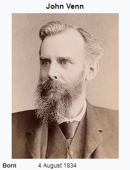

<!-- libraries -->
```{r,include=FALSE,purl=FALSE}
library(knitr) # for include_graphics() 
library(dplyr)
```

<!-- define default size for R graphics -->
```{r,include=FALSE,purl=FALSE}
outputFormat<-opts_knit$get('rmarkdown.pandoc.to')
if(outputFormat=="beamer"){
  opts_chunk$set(fig.width=6,fig.height=4)
}
```

<!-- define function for external images -->
```{r,include=FALSE,purl=FALSE}
image<-function(ff,ss,cc=NULL,ll=NULL){
  if(is.null(cc)){
    paste('\\centering','\n',
          '\\includegraphics[scale=',ss,']{',ff,'}',
          sep='')
  } else {
    paste('\\centering','\n',
          '\\copyrightbox[b]{',
          '\\includegraphics[scale=',ss,']{',ff,'}',
          '}{\\raggedleft{\\tiny \\href{',ll,'}{',cc,'}}}',
          sep='')    
  }
}
```

<!-- define function for links -->
```{r,include=FALSE,purl=FALSE}
link<-function(tt,ll){
  paste('[\\textcolor[HTML]{ffa328}{\\ul{',tt,'}}]','(',ll,')',sep='')
}
```


```{r load-libraries, message=F, warning=FALSE, echo=F}
#don't need to worry about knowing these libraries
library(jpeg)
library(grid)
```

### Learning Objectives
 - Making and using Venn diagrams for probabilities
 - General addition rule for probability
 - Conditional probability
 - Determine whether two events are independent or dependent
 - General multiplication rule for probability

## Venn diagrams

### Venn diagrams 
Popularized in a paper in 1880
```{r venn, echo=F, out.width = "30%", fig.align='center'}

```

### Venn diagrams 

```{r basic1, echo=F, out.width = "40%", fig.align='center'}
knitr::include_graphics("basic1.png")
```

- Venn diagrams generally consist of at least two events
- When we draw a rectangle around the diagram this is the sample space. All the probabilities 
inside must sum to 1.
- When you make a Venn diagram label the events using capital letters to 
represent the random variables

### Venn diagrams
Suppose you had access to survey data about vaping and JUUL-related advertisements.

You could define the following random variables:
J is the event “seen ad for JUUL”
V is the event “vaped in the last 30 days”

```{r, echo=F, out.width = "60%", fig.align='center'}
knitr::include_graphics("basic2.png")
```

### Venn diagrams 
Now let's say we do a survey - we can add the percents to the diagram:

```{r, echo=F, out.width = "60%", fig.align='center'}
knitr::include_graphics("basic-with-percents.png")
```

what percent of the individuals saw an ad for JUUL and do not vape?

### Venn diagram 

```{r, echo=F, out.width = "40%", fig.align='center'}
knitr::include_graphics("anotb.png")
```

How would we write this as a probability statement?
What percentage is this?

### Venn diagram

```{r, echo=F, out.width = "60%", fig.align='center'}
knitr::include_graphics("basic-with-percents.png")
```

What percent of individuals vape but have not seen an ad for JUUL?

### Venn diagram

```{r, echo=F, out.width = "60%", fig.align='center'}
knitr::include_graphics("bnota.png")
```

How would we write this as a probability statment?
What percentage is this?

### Venn diagram

```{r, echo=F, out.width = "60%", fig.align='center'}
knitr::include_graphics("basic-with-percents.png")
```

What percent of individuals vape AND have seen an ad for JUUL?
What is this called?

### Venn diagram

```{r, echo=F, out.width = "30%", fig.align='center'}
knitr::include_graphics("intersect.png")
```


### Venn diagram

```{r, echo=F, out.width = "60%", fig.align='center'}
knitr::include_graphics("basic-with-percents.png")
```

What percent of individuals vape  OR seen an ad for JUUL?
What is this called?

### Venn diagram
The **union** is all events that have either of the outcomes - all the shaded parts of this diagram are part of the union.

P(J or V) \
P(J $\cup$ V) \
= P(J) + P(V) - P(J $\cap$ V) **this is the general rule for addition**\
= 0.18 + 0.11 – 0.036 \
= 0.256 = 25.6%


### General addition rule 

For any two events A and B, $P(A \cup B) = P(A) + P(B) - P(A \cap B)$. 

- Why do we subtract off $P(A \cap B)$?

- This formula simplifies to $P(A \cup B) = P(A) + P(B)$ when A and B are **disjoint**.

- What does the Venn diagram look like for disjoint events?

### Decomposition of a probability
For any two events A and B, $P(A ) = P(A\cap B) + P(A\cap \bar{B})$

Which pieces of our diagram does this indicate?

### Compliments

- What is the compliment of seeing an ad for JUUL?
- What is the compliment of the intersect?
- What is the compliment of the union?

## Conditional probability

### Statistics is everywhere
You may have heard people talk about the probability of dying from a bee sting being greater than the probability of being killed by a shark.
As in this recent article, published during "shark week" 

```{r, echo=F, out.width = "60%", fig.align='center'}
knitr::include_graphics("shark.png")
```

[article here](https://www.wkyc.com/article/entertainment/shark-week-youre-way-more-likely-to-die-from-these-than-a-shark-attack/459310594)

### Statistics is everywhere
From the article:

Your odds of a dog killing you are 1 in 112,400,
Your odds of dying from one of these insects touching you is 1 in 63,225
Your odds of dying from a fired gun are 1 in 6,905
Your odds of dying from lightning are 1 in 161,856
Your odds of dying while in a car are 1 in 114

compared to about 1 in 3,748,067 for a shark attack.

It's worth noting that these are probabilities(risks) **NOT** odds in the statistical sense

People use these probabilities to argue that swimming in the ocean is safe.  Why do conditional probabilities make this argument questionable?

### Conditional Probability

When $P(A)>0$, the conditional probability of B, given A is:

$$P(B|A)=\frac{P(A\cap B)}{P(A)}$$


- Rearrange this formula for $P(A\cap B)$

$$P(A|B)=\frac{P(B\cap A)}{P(B)}$$
- What pieces of a Venn Diagram would these correspond to?

### Conditional probability

Among those who have seen an ad for JUUL, what percent vaped in the past month?

$$P(Vape|JUUL)$$

$$P(V|J) =\frac{P(J\cap V)}{P(J)}$$

### Conditional probability


```{r, echo=F, out.width = "30%", fig.align='center'}
knitr::include_graphics("bgivena.png")
```


### Conditional probability

$$P(V|J') =\frac{P(J'\cap V)}{P(J')}$$

```{r, echo=F, out.width = "30%", fig.align='center'}
knitr::include_graphics("bgivennota.png")
```


### Recall the definition for disjoint events

- What did it mean for two events to be disjoint?
- Another term for disjoint is **mutually exclusive**
- How would we draw disjoint events in a Venn diagram?

### Disjoint events

```{r, echo=F, out.width = "60%", fig.align='center'}
knitr::include_graphics("disjoint.png")
```

## Independent vs. dependent events

### Independent vs. dependent events
What sorts of events are independent? 

Two events are independent if knowing that one event occurred does not change the probability that the other occurred 


### Independent vs dependent:  example 1.  Down syndrome

Down syndrome is a genetic disorder caused when abnormal cell division results 
in an extra full or partial copy of chromosome 21.^1^ The largest risk factors 
for having a child with Down syndrome are advanced maternal age.^1^ Suppose that
Martha is 40 and her baby has been diagnosed with Down syndrome. Martha's best 
friend Jane, also 40, is hoping to conceive. Is her baby's risk of Down syndrome
independent of Martha's baby's risk?

1. https://www.mayoclinic.org/diseases-conditions/down-syndrome/symptoms-causes/syc-20355977

### Independent vs. dependent events

Question: The risk of having a baby with Down syndrome is 1/100 among 40 year 
olds. Suppose that Jenny and Samantha are two 40-year old women. What is the 
probability that they both have babies with Down syndrome?


### Independent vs. dependent events
Written out in probability notation, for any two events A and B, the events are independent if:

$$P(A|B)=P(A)$$
or 
$$P(B | A)=P(B)$$
or
$$P(A\cap B)=P(A)* P(B)$$
The "|" is read as "given" or "conditional on"

If one of these is true, they are all true.  


### Independent vs. dependent
```{r, echo=F, out.width = "60%", fig.align='center'}
knitr::include_graphics("basic-with-percents.png")
```

In our example, are the probability of seeing and ad for JUUL and vaping in the past month independent?

### Independent vs. dependent events
From our JUUL and vaping example:

$$P(V | J)=\frac{P(V\cap J)}{P(J)}= \frac{.036}{.18}=.20 $$
and 
$$P(V)=0.11$$
so 
$$P(V|J) \ne P(V)$$ 
proving that we have events that are NOT independent, knowing someones exposure to JUUL ads gives us information about their probability of having vaped.


## Multiplication rules

### Multiplication rule
For any two events, the probability that both events occur is given by:
$$P(A\cap B)= P(B|A)\times P(A)$$

### Multiplication rule for independent events
Two events A and B are **independent** if knowing that one occurs does not 
change the probability that the other occurs.

If events are independent, $P(B|A)=P(B)$ so the general multiplication rule:
$$P(A\cap B)= P(B|A)*P(A)$$
Simplifies to:

$$P(A \cap B) = P(A)\times P(B)$$


### Conditional Probability using tables

| Ad exposure               | Vape  | No Vape | Total  |
|---------------------------|-------|---------|--------|
| seen an ad for JUUL       | 0.036 | 0.144   | 0.18   | 
| did not see ad for JUUL   | 0.074 | 0.746   | 0.82   |  
| Total                     | 0.11  | 0.89    | 1      | 


What are the conditinal probabilies of vaping by Ad exposure?

## Conditional probability and diagnostic testing

### Conditional probability and diagnostic testing

Key terms:

- Sensitivity: P(test positive | truly have disease)
- Specificity: P(test negative | truly do not have disease)
- Positive predictive value: P(truly have disease | test positive)
- Negative predictive value: P(truly do not have disease | test negative)

### Conditional probability and diagnostic testing

More key terms:

|                   | Have the disease | Do not have the disease |
|-------------------|------------------|-------------------------|
| **Test positive** | True positive    | False positive          |
| **Test negative** | False negative   | True negative           |


### How to calculate the chance of having cancer if you test positive?

- Suppose that there is test for breast or prostate cancer that has a 95% chance 
of testing positive for cancer when the individuals it and a 98% chance of 
testing negative for cancer when the patient does not have it. 3% of patients in
a population have the cancer being tested for. 

### From last lecture: How to calculate the chance of having cancer if you test positive?

|                   | Have Cancer      | Do not have  Cancer     | Total  |
|-------------------|------------------|-------------------------|--------|
| **Test positive** | True positive    | False positive          |        |
| **Test negative** | False negative   | True negative           |        |
| Total             |                  |                         |        |  


### From last lecture: How to calculate the chance of having cancer if you test positive?
95% chance of testing positive for cancer when the individuals it
98% chance of testing negative for cancer when the patient does not have it. 
3% of patients in a population have the cancer being tested for. 

|                   | Have Cancer      | Do not have  Cancer     | Total  |
|-------------------|------------------|-------------------------|--------|
| **Test positive** |         57       |               39        |    96  |
| **Test negative** |          3       |             1901        |  1904  |
| Total             |         60       |             1940        |  2000  |  

### Conditional probability and diagnostic testing
What is the chance that a patient has cancer given that they test positive? 

- Positive predictive value: P(truly have disease | test positive)

- P(truly have disease | test positive)= 57/96 = 59%


### Parting humor
from XKCD

```{r, echo=F, out.width = "60%", fig.align='center'}
knitr::include_graphics("ostrich.png")
```

