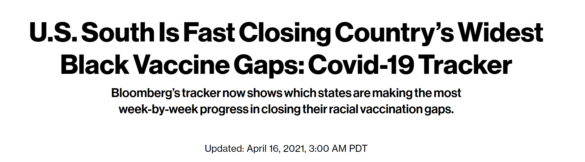
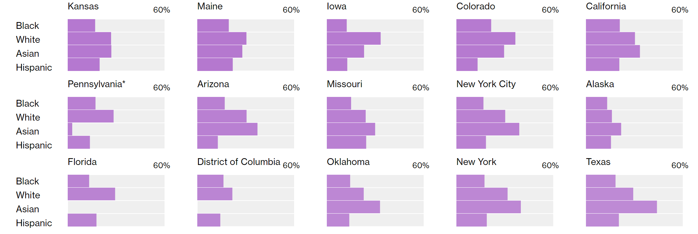
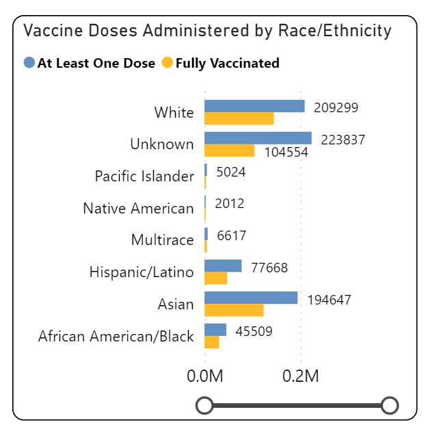
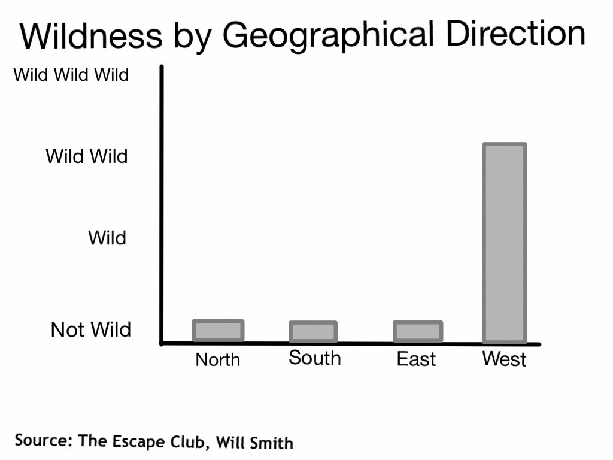

<!-- libraries -->
```{r,include=FALSE,purl=FALSE}
library(knitr) # for include_graphics() 
library(dplyr)
library(forcats)
library(readr)
library(ggplot2)
library(broom) 
library(tidyr)
library(ggplot2)
library(tibble)
```

### Goals for today
- Goodness of fit:  looking at one variable with multiple categories
- Introduce the chi-squared 


## One variable with multiple categories

### One categorical variable with more than 2 categories
- With one sample of a categorical variable with two categories (binary, yes/no) we tested that the proportion was equal to a hypothesized null (one sample test of proportions)
- When we had two samples or two groups we compared the difference in proportions.
- What do we do with one sample and a categorical variable when there are more than 2 categories?


### One categorical variable with more than 2 categories
The general pattern we will follow for these types of variables is:

- estimate how many observations we would expect in each category under our null hypothesis
- compare the number of observations in each category to the expected value
- summarize these differences and compare them to a theoretical distribution 

### Jury Selection example

Suppose that the following number of people were selected for jury duty in the 
previous year, in a county where jury selection was supposed to be random. 

| Ethnicity      | White | Black | Latinx     | Asian      | Other | Total |
|-----------------|-------|-------|------------|------------|-------|-------|
| Number selected | 1920  | 347   | 19         | 84         | 130   | 2500  |

You read online about concerns that jury was not selected randomly. How can
you test this evidence?

- Example derived from this [video](https://www.youtube.com/watch?v=Uk36WGxujkc).

### Jury Selection example

Consider the distribution of race/ethnicity in the county overall:

| Ethnicity          | White | Black | Latinx | Asian  | Other | Total |
|---------------------|-------|-------|--------|--------|-------|-------|
| % in the population | 42.2% | 10.3%| 25.1%  | 17.1%   | 5.3% | 100%  |


How do we determine the counts that are **expected** (**E**) under the assumption that selection was random?:

| Ethnicity      | White | Black | Latinx     | Asian      | Other | Total |
|-----------------|-------|-------|------------|------------|-------|-------|
| Expected count  |       |       |            |            |       | 2500  |


### Jury Selection example

| Ethnicity          | White | Black | Latinx | Asian  | Other | Total |
|---------------------|-------|-------|--------|--------|-------|-------|
| % in the population | 42.2% | 10.3%| 25.1%  | 17.1%   | 5.3% | 100%  |

- To fill in the table, multiple the total size of the jury by the % of the 
population of each race/ethnicity:

Expected counts under the assumption that selection is random from the county:

| Ethnicity      | White       | Black     | Latinx     | Asian      | Other       | Total |
|:---------------:|:-----------:|:-----------:|:----------:|:----------:|:-----------:|:-----:|
| Expected count  | 2500 $\times$ 0.422 | 2500 $\times$ 0.103 | 2500 $\times$ 0.251 | 2500 $\times$ 0.171| 2500 $\times$ 0.053 | 2500  |
| = | 1055  | 257.5 | 627.5      |  427.5     | 132.5 | 2500  |


### Jury Selection example

How far off does the **observed counts** of race/ethnicities in the sample differ
from what we would expect if the jury had been selected randomly?

### Jury Selection example

Here are the counts we **observed** (**O**):

| Ethnicity      | White | Black | Latinx     | Asian      | Other | Total |
|-----------------|-------|-------|------------|------------|-------|-------|
| Observed count  | 1920  | 347   | 19         | 84         | 130   | 2500  |

Which we can compare to our **expected** (**E**):

| Ethnicity      | White       | Black     | Latinx     | Asian      | Other       | Total |
|:---------------:|:-----------:|:-----------:|:----------:|:----------:|:-----------:|:-----:|
| Expected count  |  1055  | 257.5 | 627.5      |  427.5     | 132.5 | 2500  |


### Jury Selection example

This plot shows the deviations between the observed and expected number of jurors.
What is the chance of observed deviations of these magnitudes (or larger) under the
null  hypothesis?

```{r, out.width="80%", fig.align='center', echo=F}

library(ggplot2)
observed_counts <- c(1920, 347,   19,    84, 130)
expected_counts <- c(1055, 257.5, 627.5, 427.5, 132.5)
race <- c("White", "Black", "Latinx", "Asian", "Other")
jury_data <- data.frame("observed_counts" = observed_counts, "expected_counts" = expected_counts, "race" = race)

ggplot(jury_data, aes(y = race, x = observed_counts)) + 
  geom_segment(aes(xend = expected_counts, yend = race)) +
  geom_point(aes(col = "Observed")) + 
  geom_point(aes(col = "Expected", x = expected_counts)) +
  theme_minimal(base_size = 15) +
  labs(x = "Observed (teal) vs. expected (pink) number of jurors",
       title = "Deviations between observed and expected number of jurors")

```

### Jury Selection example

- Recall the usual form of the test statistic:

$$\frac{estimate - null}{SE}$$

- We want an estimate that somehow quantifies how different the observed counts ($O$)
are from the expected counts ($E$) across the 5 race/ethnicities. 

### The Chi-square test statistic

The chi^2^ test statistic quantifies the magnitude of the difference between observed
and expected counts under the null hypothesis. It looks like this:

$$\chi^2 = \sum_{i=1}^k\frac{(O_i-E_i)^2}{E_i}$$

- $k$ is the number of cells in the table. Here, $k$ is the number of race/ethnicity groups. That is, $k=5$
- $O_i$ is the observed count for the $i^{th}$ group (here race/ethnicity)
- $E_i$ is the expected count for the $i^{th}$ group 
- $\chi^2$ is a distribution, like $t$ or Normal.

### The Chi-square test statistic

$$\chi^2 = \sum_{i=1}^k\frac{(O_i-E_i)^2}{E_i}$$

- The numerator measures the squared deviations between the observed (O) and 
expected (E) values. Bigger deviations will make the test statistic larger 
(which means that its corresponding p-value will be smaller)

- The denominator makes this magnitude *relative* to what we expect. This adjusts
for the different magnitude of expected counts. For example, with our example, we
would *expect* the number of white jurors to be close to 1055, but we would expect
the number of Latinx jurors to be close to 628. Therefore, we divide by these
expectations such that a difference of 100 fewer Latinx jurors than expected 
counts for more than a difference of 100 few white jurors.


### Conditions to perform a chi-square test

- Fixed $n$ of observations
- All observations are independent of one another. What does this mean in our jury example?
- Each observation falls into just one of the $k$ mutually exclusive categories
- The probability of a given outcome is the same for each observation. 

### Counts requirement

- At least 80% of the cells have 5 or more observations ($O_i \geq 5$ for $\geq$ 80% of the cells)
- All $k$ cells have expected counts > 1 ($E_i > 1$)


## The Chi-Square distribution

### The Chi-square distribution

The chi-square distribution is a new distribution to us. Like the t-distribution,
the chi-square distribution only has one parameter: a degrees of freedom. The 
degrees of freedom is equal to the number of groups (here, race/ethnicities) - 1.
Or, $df=k-1$.

```{r, out.width="60%", fig.align='center', echo=F}
# ggplot of the distribution at varying degrees of freedom

ggplot(data = data.frame(x = c(0.1, 30)), aes(x)) + 
  #geom_area(stat = "function", fun = dchisq, args = list(df=9),
      #      xlim = c(12, 20), fill = "grey") +
  stat_function(fun = dchisq, n = 101, args = list(df=2), aes(col = "df=2")) +
  stat_function(fun = dchisq, n = 101, args = list(df=4), aes(col = "df=4")) +
  stat_function(fun = dchisq, n = 101, args = list(df=9), aes(col = "df=9")) +
  stat_function(fun = dchisq, n = 101, args = list(df=15), aes(col = "df=15")) +
  theme_minimal(base_size = 15) + 
  theme(aspect.ratio=1) +
  labs(y = "Density", title = "Chi-squared distributions")
```
### The shape of the Chi-square
- As the `df` is increased, the distribution's central tendency moves to the right.
- This means that there will be more probability out in the right tail when the
degrees of freedom is higher. 
- The chi-square distribution is also positive. We only ever compute upper tail 
probabilities for the chi-square test because there is only one form to the $H_a$.

### Back to the jury example

**State the null and alternative hypotheses.** 

- The null hypothesis is that the proportions of each race/ethnicity in the jury 
pool is the same as the proportion of each group in the county. That is:

$H_0: p_{white} = 42.2\% \text{, }p_{black}=10.3\%\text{, }p_{latinx}=25.1\%\text{, }p_{asian}=17.1\%\text{, }p_{other}=5.3\%$

$H_a:$ At least one of $p_k$ is different than specified in $H_0$, for k being 
one of white, black, latinx, asian, or other.

### Back to the jury example

**Calculate the chi-square statistic using the jury data.**

| Ethnicity      | White | Black | Latinx     | Asian      | Other | Total |
|-----------------|-------|-------|------------|------------|-------|-------|
| O               | 1920  | 347   | 19         | 84         | 130   | 2500  |
| E               | 1055  | 257.5 | 627.5      | 427.5      | 132.5 | 2500  |

$\chi^2 = \sum_{i=1}^k\frac{(O_i-E_i)^2}{E_i}$

$\chi^2 = \frac{(1920-1055)}{1055}^2 + \frac{(347-257.5)}{257.5}^2 + \frac{(19-627.5)}{627.5}^2 + \frac{(84-427.5)}{427.5}^2 + \frac{(130-132.5)}{132.5}^2$

$\chi^2 = 709.218 + 31.10777 + 590.0753 + 276.0053 + 0.04716981$

$\chi^2 = 1606.454$

### Back to the jury example

**Calculate the p-value (what is the approprate degrees of freedom?).**

```{r}
pchisq(q = 1606.454, df = 4,lower.tail = F)
```

The probability of seeing this pool of people chosen for jury duty under the 
null hypothesis of random sampling from the county is so small that R rounded 
the p-value to 0! 

### Chi-square test in R

**Run the chi-square test using the `chisq.test` command in R.**

```{r}
chisq.test(x = c(1920, 347, 19, 84, 130), # x is vector of observed counts
           p = c(.422, .103, .251, .171, .053)) # p is probability under the null
```

### Interpretation

- Which race/ethnicities appear to deviate the most from what was expected under
the null hypothesis?
    - Compare the proportion observed vs. proportion expected
    - Compare the count observed vs. the count expected
    - Compare the 5 contributions to the chi-square test from each race/ethnicity.
    We see that whites, Latinx, and Asians contribute the most to the $\chi^2$
    statistic. This agrees with what we saw in the data visualization in terms
    of the size of the gaps between observed and expected counts.


## Statistics is Everywhere

### COVID vaccine roll out

```{r, fig.align='center', out.width="65%", echo=FALSE }

```

### COVID vaccine roll out
One hypothesis in the article is that "Now that almost all adults in the U.S. are eligible for Covid vaccines, the racial and ethnic disparities among those getting shots should narrow."

### Visualization by race/ethnicity

```{r, fig.align='center', out.width="65%", echo=FALSE }

```

How do we know if the variability is due to chance?

How could we see what the distribution is like for Alameda County?

### From Alameda County Data website 16 April 2021

```{r, fig.align='center', out.width="65%", echo=FALSE }

```
### Example 2:  Alameda 

| Race/Eth.   | White   |  PI    |Nat. Am. | Multirace | Latinx     | Asian  | AA/Black | Total |
|-------------|---------|--------|---------|-----------|------------|--------|----------|-------|
| #Vaccinated | 209299  |  5024  |2012     |6617       | 77668      | 194647 |45509     | 540776|


| Race/Eth.   | White   |  PI    |Nat. Am. | Multirace | Latinx     | Asian  | AA/Black | Total |
|-------------|---------|--------|---------|-----------|------------|--------|----------|-------|
| Percent Pop | 30.6%   |  0.9%  |1.1%     |5.4%       | 18.7%      | 32.3%  |11.0%     |  100% |


**we will remove "unknown" for now, and subtract them from the total to get 540776 individuals vaccinated with known Race/Ethnicity

### Example 2:  Alameda 


| Race/Eth.    | White   |  PI    |Nat. Am. | Multirace | Latinx     | Asian  | AA/Black | Total |
|--------------|---------|--------|---------|-----------|------------|--------|----------|-------|
| Percent  Pop | 30.6%   |  0.9%  |1.1%     |5.4%       | 18.7%      | 32.3%  |11.0%     |  100% |
| Percent doses| 38.7%   |  0.9%  |   0.4%  | 1.2%      | 14.4%      | 36.0%  |8.4%      | 100%  |


### Example 2:  Alameda Chi-square test in R

**Run the chi-square test using the `chisq.test` command in R.**

```{r}
chisq.test(x = c(209299,5024,2012,6617,77668,194647,45509), # x is vector of observed counts
           p = c(.306,.009,.011,.054,.187,.323,.11)) # p is probability under the null
```


### Example 3:  cheating at dice?
Suppose there is a game in which the objective is to roll sixes as possible using 3 die.
Over 100 rolls, one of the players seems to be winning quite often, we see the following 

| Number of 6s    | 0     | 1     | 2    | 3    | 
|:---------------:|:-----:|:-----:|:----:|:----:|
| Observed rolls  |  47   | 35    | 15   |  3   |

We suspect they are using a loaded die or cheating in some way.  

Are they cheating?  Or just lucky (within the bounds of chance)?

Example derived from [this](http://www.stat.yale.edu/Courses/1997-98/101/chigf.htm) site

### Example 3:  cheating at dice?
What would we expect?  
The rolls of dice should follow a binomial distribution (# of successes in # trials)


$$P(X=k)={n\choose k}p^k(1-p)^{n-k}$$
What is P here?  What is K?

### Example 3:  cheating at dice?
Remember dbinom?

'dbinom(#successes,size,probability of success)'

This function calculates the probability of observing `x` successes when $X \sim Binom(n,p)$

```{r binoms, echo=TRUE}
Expect_0<-dbinom(0,size=3,prob=0.166666667)
Expect_1<-dbinom(1,size=3,prob=0.166666667)
Expect_2<-dbinom(2,size=3,prob=0.166666667)
Expect_3<-dbinom(3,size=3,prob=0.166666667)
Expected<-c(Expect_0,Expect_1,Expect_2,Expect_3)
Expected
``` 

### Example 3:  cheating at dice?

| Number of 6s    | 0     | 1     | 2    | 3    | 
|:---------------:|:-----:|:-----:|:----:|:----:|
| Observed rolls  |  47   | 35    | 15   |  3   |
| Expected rolls  |  57.9 | 34.7  | 6.9  |  0.46|


### Exampe 3:  cheating at dice?
```{r}
chisq.test(x = c(47,35,15,3), # x is vector of observed counts
           p = Expected) # p is probability under the null
```


### Parting humor, courtesy of the Comedian Erik Tanouye

```{r parting, fig.align='center', out.width="65%", echo=FALSE }

```


