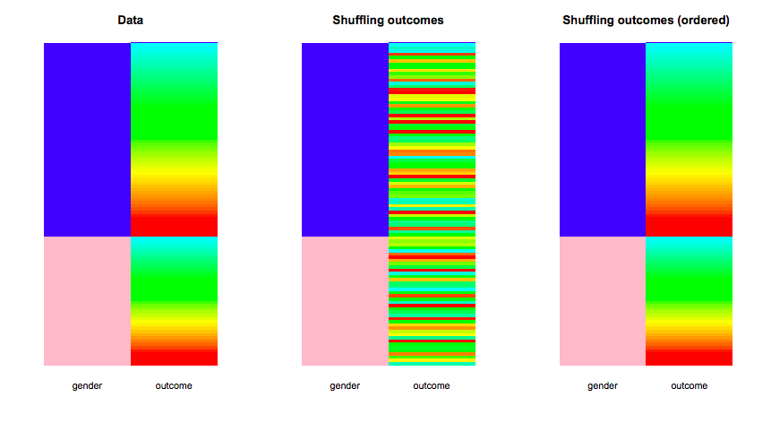
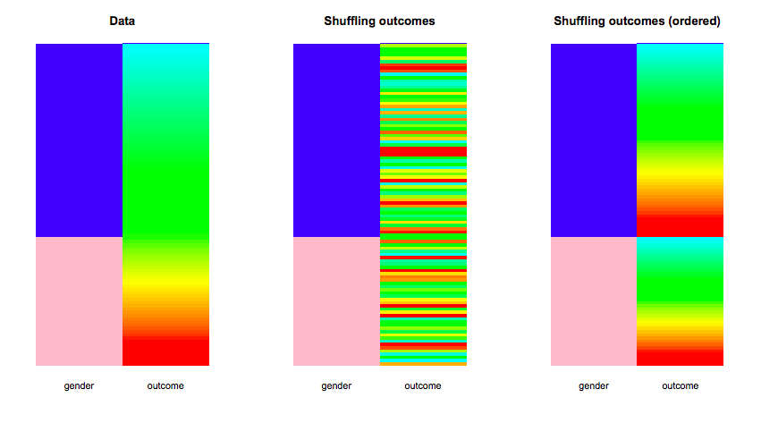

<!-- libraries -->
```{r,include=FALSE,purl=FALSE}
library(knitr) # for include_graphics() 
library(dplyr)
library(forcats)
library(readr)
library(ggplot2)
library(broom) 
library(tidyr)
library(ggplot2)
library(tibble)
library(infer)
```

### In this lecture:

- Introduce permutations 

**note, bootstraping and permutations are not in your book and will be included in the exam only as extra credit


## Permutation 

### Permutation tests

The majority of the methods we've used so far for hypothesis testing (z-tests, t-tests, and 
chi-square tests) have depended on having large enough sample sizes for the 
inference to be valid. They have also required that the sample was a SRS from 
some larger population.

Today we will talk about another method for conducting hypothesis tests that 
do not require either assumption. 

It might remind you of our bootstrapping lecture, but remember, bootstrapping was
for confidence intervals, whereas permutation tests are for hypothesis testing.

### Permutation tests
- Permutation tests are another way to get p-values for hypothesis tests.
- These tests are based on reshuffling (or permuting) the data to break
any relationship between the two variables.

### Permutation test, shown visually
Example: null is true
```{r, out.width="80%", echo=F}

```

If the null is *true* then the distribution of the response variable is the same
for each level of the explanatory variable. This is shown by the entire spectrum
of colors for both levels of the explanatory variable in this plot. 

### Permutation test, shown visually
Example: null is true
```{r, out.width="80%", echo=F}

```

After reshuffling, the distribution comes out the same. This illustrates that if 
the null is true, your observed statistic will look like a random reshuffle.
reference: http://faculty.washington.edu/kenrice/sisg/SISG-08-06.pdf

### Permutation test, shown visually

Example: null is false

```{r, out.width="80%", echo=F}

```

If the null is *false* the distribution of the response variable varies for 
each level of the explanatory variable. 

### Permutation tests
For a test looking at difference between 2 groups:

- We summarize the outcome in each of our two groups (2 means, 2 proportions etc) 
- The null hypothesis is that there is no difference between these two groups.
- Consider the number of possible configuration of the experimental group and the observed response.
- Generate either a full set of all possible configurations or a random set of a desired # of possible outcomes
- For each possible configuration, compute the outcome in each group and our desired measure (difference)
- Create the distribution of all computed outcomes
- Calculate a p-value based upon our observed response relative to all of the potential experimental groups.

### Example: Beer consumption and mosquito attraction to humans
Background: Malaria and alcohol consumption both represent major public health 
problems. Alcohol consumption is rising in developing countries and, as efforts 
to manage malaria are expanded, understanding the links between malaria and 
alcohol consumption becomes crucial. Our aim was to ascertain the effect of beer
consumption on human attractiveness to malaria mosquitoes in semi field 
conditions in Burkina Faso. - [Lefevre et al, 2010, in *PLOS One*](https://journals.plos.org/plosone/article?id=10.1371/journal.pone.0009546)

### Example: Beer consumption and mosquito attraction to humans

- Volunteers were randomly assigned to drink either beer or water
- Batches of mosquitoes were inside a device and could choose to fly towards the
human participant or towards the open air
- The number of mosquito flying towards the human were counted for each participant

### Example: Beer consumption and mosquito attraction to humans
The data:

```{r, echo=TRUE}
beer <- c(27, 19, 20, 20, 23, 17, 21, 24, 31, 26, 28, 20, 
          27, 19, 25, 31, 24, 28, 24, 29, 21, 21, 18, 27, 
          20)

water <- c(21, 19, 13, 22, 15, 22, 15, 22, 20, 12, 24, 24, 
           21, 19, 18, 16, 23, 20)

mosq_data <- data.frame(num_mosquitos = c(beer, water), 
                        treatment = c(rep("beer", 25),
                                      rep("water", 18)))
```


### Example: Beer consumption and mosquito attraction to humans
`beer` is a vector of the count of mosquitoes the flew towards the participant
for the 25 people randomized to beer

`water` is the same thing but for those 18 people randomized to drink water


### Example: Beer consumption and mosquito attraction to humans

Descriptives: Does there look to be a difference between the groups?

```{r, echo=F, fig.align='center', out.width="80%"}
library(ggplot2)

ggplot(mosq_data, aes(x = treatment, y = num_mosquitos)) +
  geom_boxplot(aes(fill = treatment)) + 
  theme_minimal(base_size = 15) +
  labs(y = "Number of mosquitos", x = "")
```


### Example: Beer consumption and mosquito attraction to humans
What type of variable is the exposure here?

What type of variable is the outcome?

How might we approach this with a parametric test?

### Example: Beer consumption and mosquito attraction to humans
```{r}
t.test(beer, water, alternative = "two.sided")
```
The average number of mosquitoes attracted to beer drinkers was 23.6 vs. 19.22 
attracted to water drinkers.  What is the p-value?

### Example: Beer consumption and mosquito attraction to humans

There is another way to perform this test. Consider the null hypothesis:

$$H_0: \mu_1 = \mu_2$$

If the two means are the same, then we would expect no difference between the 
number of mosquitoes attracted to beer drinkers vs. water drinkers. 

### Example: Beer consumption and mosquito attraction to humans
Permutation approach:

Assuming the null is true:

**We could mix up the labels of who drank beer and who had water and 
re-compute the difference between beer- and water-drinkers in the number of 
mosquitoes.**

We could do this many times. For each shuffling of the labels, we could 
re-compute the difference and mark it on a histogram.

### Example: Beer consumption and mosquito attraction to human

Watch this clip from 8:13-9:52: https://youtu.be/5Dnw46eC-0o?t=492.

- It shows the sampling distribution being built for this example under
the null hypothesis of no difference.
- It shows how the labels can be shuffled at random, and after each re-shuffling, 
the mean difference is computed and plotted on an evolving histogram.
- Then a vertical line is added at the **observed** value of the difference 
(based on the data from the sample).
- An observed value in the tails of the distribution implies that it is unlikely
to occur under the null hypothesis.

## The 'infer' package in R

### The `infer` package

The `infer` package is relatively new to the tidyverse (which includes `ggplot2`,
`readr`, `dplyr`, among others)

It is **awesome** because it interjects the steps of hypothesis testing directly
into the code. It also keeps things "tidy" meaning that the output is often
returned in a nice little data frame.

You can use `infer` to conduct permutation tests, but if you're interested you 
could also learn more [here](https://infer.netlify.com/) about doing all your
testing using this package.

Let's have a look!

### The `infer` package for permutation tests

First use the `infer` functions `specify()`, `hypothesize()`, `generate()`, 
and `calculate` to create the histogram of the sampling distribution for the 
mean difference:

```{r, warning=FALSE, message=FALSE}
null_distn <- mosq_data %>% 
  specify(response = num_mosquitos, explanatory = treatment) %>%
  hypothesize(null = "independence") %>%
  generate(reps = 1000, type = "permute") %>%
  calculate(stat = "diff in means", order = c("beer", "water"))
```


### The `infer` package for permutation tests
```
head(null_distn)
```


### The `infer` package for permutation tests

Then, use the `infer` function `visualize` to plot the sampling distribution, 
add a line at the observed mean difference, and shade the region corresponding
to the p-value:

```{r, fig.align='center', out.width="60%", warning=FALSE, message=FALSE}
null_distn %>% visualize(obs_stat = 23.6-19.22, direction = "two_sided")  
```

### The `infer` package for permutation tests

Finally, calculate the p-value by using the `get_pvalue()` function:

```{r}
null_distn %>% get_pvalue(obs_stat = 23.6-19.22, direction = "two_sided")
```

### In summary

- Permutation tests are another way to get p-values for hypothesis tests.
- There is a permutation test equivalent for all the two sample tests that 
we've covered. 
- Permutation tests rely on reshuffling (or permuting) the data to break
any relationship between the two variables.
- The `infer` package is a good way to conduct and visualize permutation tests in R.


### The end of new material
```{r, fig.align='center', out.width="70%", echo=FALSE }


